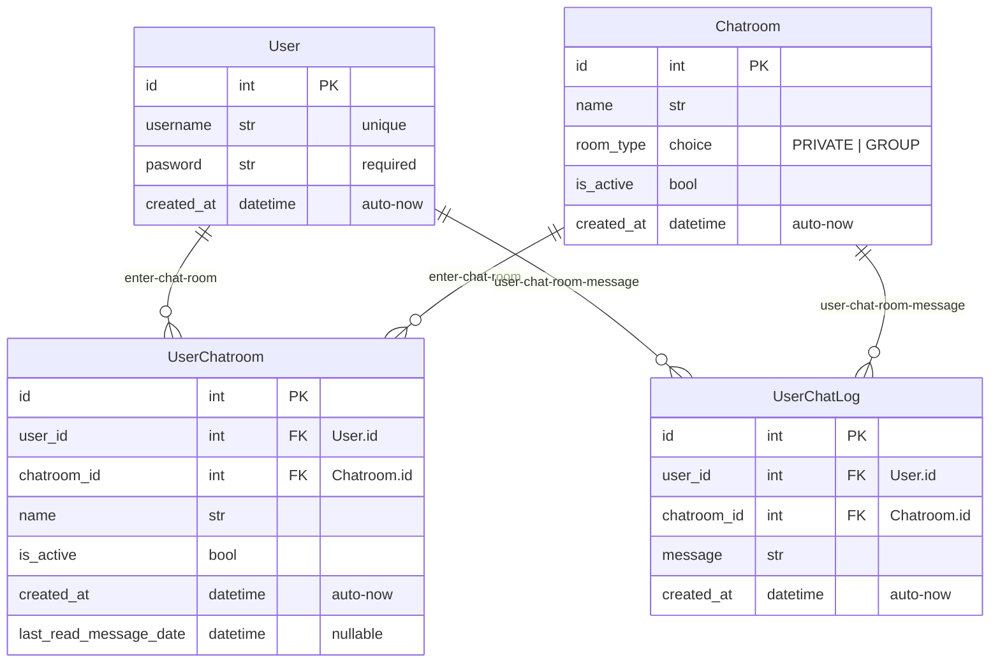

```mermaid
erDiagram
    User {
        id int PK ""
        username str  "unique"
        pasword str  "required"
        created_at datetime  "auto-now"
    }
    Chatroom {
        id int PK ""
        name str  ""
        room_type choice  "PRIVATE | GROUP"
        is_active bool 
        created_at datetime  "auto-now"
    }
    UserChatroom{
        id int PK ""
        user_id int FK "User.id"
        chatroom_id int FK "Chatroom.id"
        name str  ""
        is_active bool 
        created_at datetime  "auto-now"
        last_read_message_date datetime  "nullable"
    }
    UserChatLog{
        id int PK ""
        user_id int FK "User.id"
        chatroom_id int FK "Chatroom.id"
        message str  ""
        created_at datetime  "auto-now"

    }
    User ||--o{ UserChatroom : enter-chat-room
    Chatroom ||--o{ UserChatroom : enter-chat-room
    User ||--o{ UserChatLog : user-chat-room-message
    Chatroom ||--o{ UserChatLog : user-chat-room-message
```