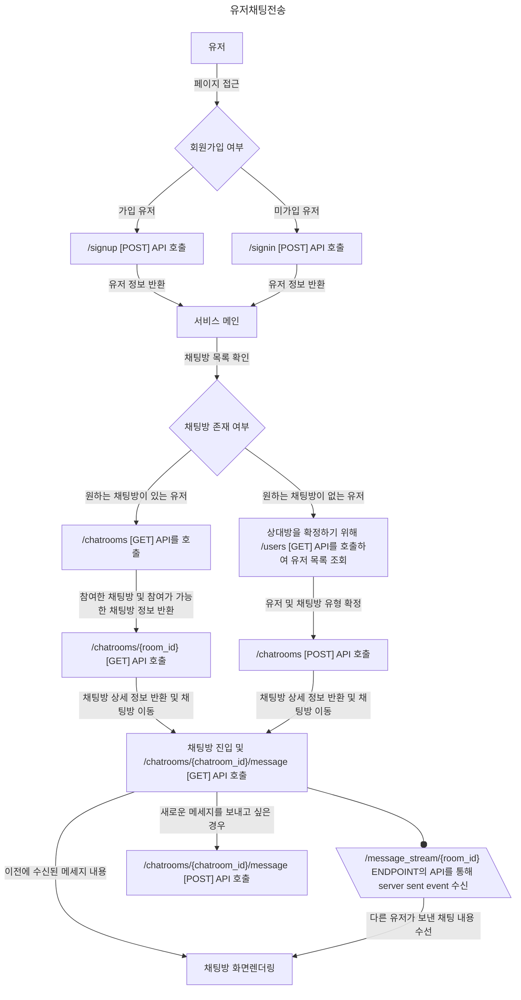

```mermaid
---
title: 유저채팅전송
---
flowchart
    A[유저] -->|페이지 접근| B
    B{회원가입 여부} -->|가입 유저| C["/signup [POST] API 호출"]
    B -->|미가입 유저| D["/signin [POST] API 호출"]
    C -->|유저 정보 반환| E[서비스 메인]
    D -->|유저 정보 반환| E
    E -->|채팅방 목록 확인| F{채팅방 존재 여부}

    F -->|원하는 채팅방이 있는 유저| G["/chatrooms [GET] API를 호출"]
    G -->|참여한 채팅방 및 참여가 가능한 채팅방 정보 반환| G2["/chatrooms/{room_id} [GET] API 호출"]
    
    F -->|원하는 채팅방이 없는 유저| H["상대방을 확정하기 위해 /users [GET] API를 호출하여 유저 목록 조회"]
    H -->|유저 및 채팅방 유형 확정| I["/chatrooms [POST] API 호출"]
    
    G2 -->|채팅방 상세 정보 반환 및 채팅방 이동| J["채팅방 진입 및 /chatrooms/{chatroom_id}/message [GET] API 호출"]
    I -->|채팅방 상세 정보 반환 및 채팅방 이동| J

    
    J --o Jp[\"/message_stream/{room_id} ENDPOINT의 API를 통해 server sent event 수신"\]
    
    J -->|새로운 메세지를 보내고 싶은 경우| L["/chatrooms/{chatroom_id}/message [POST] API 호출"]

    J -->|이전에 수신된 메세지 내용| K[채팅방 화면렌더링]
    Jp -->|다른 유저가 보낸 채팅 내용 수선| K
```